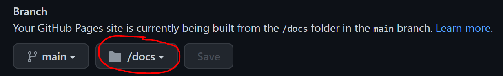

# Angular app in Githib page

## Create Repository on github

- Create a new repository named username.github.io, where username is your username (or organization name) on GitHub. 
- Repository must be public.

> it won’t work if the first part of the repository doesn’t exactly match your username.

## Install [Angular CLI](https://angular.io/guide/setup-local) if needed

```bash
> npm install -g @angular/cli
```

## Create and configure your Angular application locally

***Clone the newly created repository***

```bash
> git clone https://github.com/username/username.github.io.git
> cd username.github.io
```

***Create a new angular project in the root directory of the repo:***

```bash
> ng new myApp --directory ./ 
```

***Change the buildOutput path to “docs”***

***Build the angular application in production mode***

```bash
> ng build --configuration production
```

## Push the code to GitHub and configure the repository

```bash
> git add . 
> git commit -m "Init app"
> git push 
```

### Configure the repository to use the “docs” folder to build the page

Navigate to the settings for your repository or enter the url https://github.com/username/username.github.io/settings

- Select "Pages" from left panel

